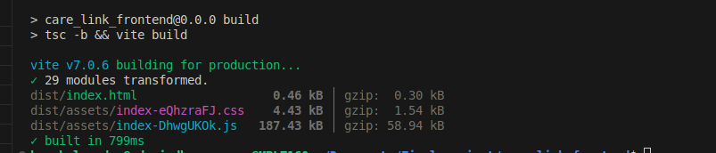

# React + TypeScript + Vite   Care Link

This template provides a minimal setup to get React working in Vite with HMR and some ESLint rules.

Currently, two official plugins are available:
## System configuration
```
node v24.2.0
npm 11.3.0 
```

## Expanding the ESLint configuration

If you are developing a production application, we recommend updating the configuration to enable type-aware lint rules:

```
  npm install
  npm run dev
```
## Git Rule

```
git add file_name
git commit -m "feat: commit_message"
git origin branch_name push
git origin dev pull
  
```
## Before push code. please make a build

```
npm run build
```
 This message you will recive after succesfull build.



### Must install Prettier(code formatter)
